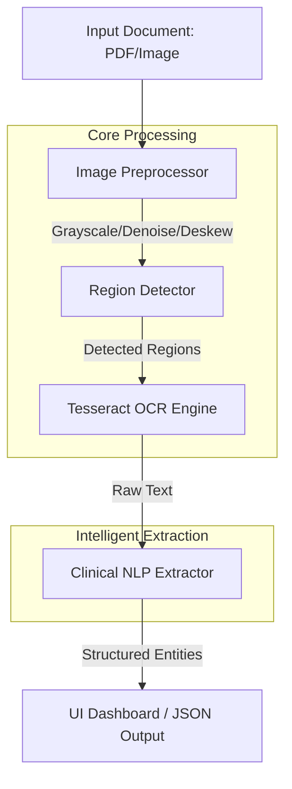

# Computer Vision + Medical OCR Pipeline

A professional-grade pipeline for analyzing, OCR-ing, and extracting structured clinical data from medical documents (Prescriptions, Lab Reports, Discharge Summaries).

##  Pipeline Architecture



##  Key Features
- **Advanced Preprocessing**: OpenCV-based grayscale conversion, non-local means denoising, adaptive thresholding, deskewing, and bicubic upscaling to maximize Tesseract accuracy.
- **Logical Segmentation**: Intelligent layout analysis using heuristic vertical whitespace detection with fallback support for YOLOv8 model-based region classification.
- **Tesseract Engine Wrapper**: Optimized Tesseract configuration utilizing the LSTM OCR engine with custom character whitelisting and context-aware Page Segmentation Modes (PSM).
- **Clinical NLP Extractor**: Advanced Named Entity Recognition (NER) using spaCy (`en_core_web_sm`) combined with high-precision regex patterns for medications, lab values, and diagnoses.
- **Professional Dashboard**: A production-ready Streamlit interface featuring a modular layout, real-time performance metrics (latency, OCR confidence), and JSON export capabilities.

##  Project Structure
- `src/`: Core processing modules.
  - `preprocessor.py`: OpenCV image enhancement pipeline.
  - `detector.py`: Document layout and region analysis.
  - `ocr_engine.py`: Professional Tesseract wrapper.
  - `nlp_extractor.py`: Clinical entity extraction logic.
  - `pipeline.py`: End-to-end orchestrator and CLI.
- `ui/`: Streamlit web application.
- `data/`: Synthetic document generation scripts and sample clinical text inputs.

## Installation

### 1. System Dependencies
Install Tesseract OCR and Poppler (required for PDF rendering):
```bash
brew install tesseract poppler
```

### 2. Python Environment Setup
```bash
# Create and activate virtual environment
python3 -m venv venv
source venv/bin/activate

# Install dependencies
pip install -r requirements.txt

# Download the clinical spaCy model
python -m spacy download en_core_web_sm
```

##  Usage

### Streamlit Dashboard
Launch the professional dashboard to interactively upload and analyze documents:
```bash
source venv/bin/activate
streamlit run ui/app.py
```

### Command Line Interface
Run the pipeline directly from the terminal for batch processing or automation:
```bash
# Process a specific file
python src/pipeline.py path/to/document.pdf

# Run the built-in demo over synthetic documents
python src/pipeline.py --demo
```

##  Technical Details
- **OCR Engine**: Tesseract (LSTM mode) with specialized whitelisting for medical symbols.
- **NLP Engine**: spaCy NER for person/org detection + custom medical keyword heuristics.
- **Preprocessing**: 2000px width standardization for consistent OCR performance regardless of source size.

##  License
MIT
